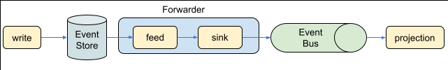
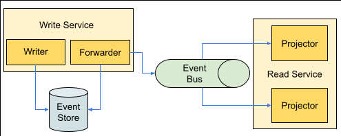
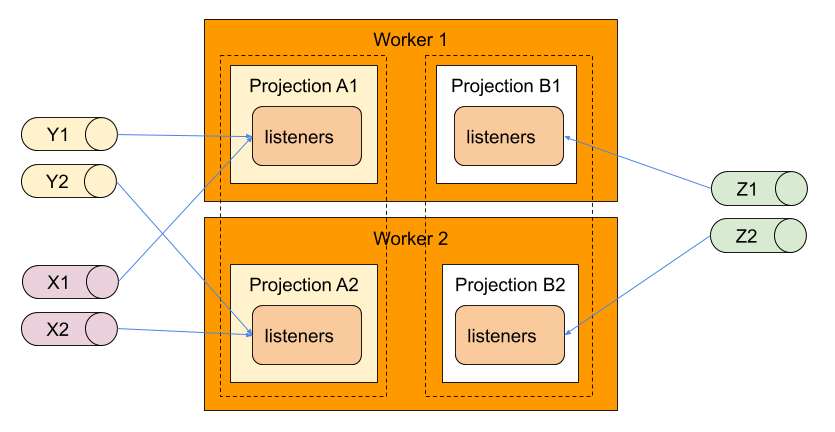

# Event Sourcing
a simple implementation of event sourcing using a database as an event store

This is an exercise on how I could implement event sourcing and how this could be used with CQRS.

## Introduction

The goal of this project is to implement an event store and how this event store could be used with the Event Sourcing + CQRS Architecture pattern where each side (write and read) can scale independently.

This library provides a common interface to store domain events in a database, like MongoDB, and to stream the events to an event bus like NATS and eventually be consumed by a projector.

This project offers implementation for the following:

**Event Stores**
* MySQL
* PostgreSQL
* Mongo

and

**Event BUS**
* NATS
* Kafka


To use CQRS it is not mandatory to have two separate databases, so it is not mandatory to plug in the change stream into the database.
We can write the read model into the same database in the same transaction as the write model (dual write).

Other than the event store and the event streaming I also implemented a simple orchestration layer for the event consumer on the read side to create projections.

> Creating a projection may take hours or even days, depending on the amount of event history so it is a good idea to create a projection on the side and start using it after it has catch up.


## Quick start

an example demonstrating mysql event store store producing events to kafka and projecting them

The codec registry:

```go
func NewJSONCodec() *jsoncodec.Codec {
	c := jsoncodec.New()
	c.RegisterFactory(KindAccount, func() eventsourcing.Kinder {
		return account.Dehydrated()
	})
	c.RegisterFactory(KindAccountCreated, func() eventsourcing.Kinder {
		return &account.Created{}
	})
	c.RegisterFactory(KindMoneyDeposited, func() eventsourcing.Kinder {
		return &account.Deposited{}
	})
	c.RegisterFactory(KindMoneyWithdrawn, func() eventsourcing.Kinder {
		return &account.Withdrawn{}
	})
	c.RegisterFactory(KindOwnerUpdated, func() eventsourcing.Kinder {
		return &account.OwnerUpdated{}
	})
	return c
}
```

The producer (forwarding events):

```go
logger := ... // slog
config := ... // get configuration into your custom structure

// store
kvStore := mysql.NewKVStore(config.Url, "resumes")

// sinker provider
sinker, _ := kafka.NewSink(logger, kvStore, "my-topic", config.KafkaUris)

dbConf := mysql.DBConfig{
	Host:     config.Host,
	Port:     config.Port,
	Database: config.Database,
	Username: config.Username,
	Password: config.Password,
}
feed, _ := mysql.NewFeed(logger, dbConf, sinker)

// setting nil for the locker factory means no lock will be used.
// when we have multiple replicas/processes forwarding events to the message queue,
// we need to use a distributed lock.
forwarder := projection.EventForwarderWorker(logger, "forwarder-id", nil, feed.Run)
worker.RunSingleBalancer(ctx, logger, forwarder, 5*time.Second)
```

The consumer (building projections):

```go
logger := ... // slog
// create projection that implements projection.Projection
proj := ...

esRepo, _ := mysql.NewStoreWithURL(dburl)
sub, _ := kafka.NewSubscriberWithBrokers(ctx, logger, kafkaUris, "my-topic", nil)
// store
kvStore := mysql.NewKVStore(dbConfig.Url, "resumes")

// repository here could be remote, like GrpcRepository
projector := projection.Project(logger, nil, esRepo, sub, proj, 1, kvStore)
projector.Start(ctx)
```

Writing to aggregates:

```go
// codec registry
reg := NewJSONCodec()
store, _ := mysql.NewStoreWithURL(url)
es := eventsourcing.NewEventStore[*account.Account](store, reg, nil)

id := util.NewID()
acc, _ := account.New("Paulo", id, 100)

acc.Deposit(10)
acc.Deposit(20)

es.Create(ctx, acc)
```


**Components**:
- utility to read/write to/from an event store
- database change listeners to propagate changes into a message stream
- message stream listeners to build read models (Projection)
- message stream listeners to react to domain events (Reactors)

> **Projections**: can be rebuild since the beginning of time


## Eventually consistent projection


A service **writes** to a **database** (the event store), a **forwarder** component (can be on the write service or it can be an external service) listens to inserts into the database (change stream) and forwards them into a **event bus**, then a **projection** listen to the event bus and creates the necessary read models.



> we still can still use consistent projections to build the current state of an aggregate

## How to

I assume that the reader is familiar with the concepts of event sourcing and CQRS.

> **Warning**: Code examples below may be outdated

### Aggregate

The aggregate must "extend" `eventsourcing.RootAggregate`, that implements `eventsourcing.Aggregater` interface, and implement `eventsourcing.Typer` and `eventsourcing.EventHandler` interface.
Any change to the aggregate is recorded as a series of events.

You can find an example [here](./test/aggregate.go#L96)

### Factory

Since we will deserializing events we will need a factory to instantiate the aggregate and also the events. This factory can be reused on the read side, to instantiate the events.

Example [here](./test/aggregate.go#L60)

### Codec

To encode and decode the events to and from binary data we need to provide a `eventsourcing.Codec`. This codec be as simple as a wrapper around `json.Marshaller/json.Unmarshaller` or a more complex implementation involving a schema registry.

### Upcaster

As the application evolves, domain events may change in a way that previously serialized events may no longer be compatible with the current event schema. So when we rehydrate an event, we must transform into an higher version of that event, and this is done by providing an implementation of the `eventsourcing.Upcaster` interface.

> Another option is to use [event migration](./eventstore.go#L105)

### Events

Events must implement the `eventsourcing.Eventer` interface.

Example [here](./test/aggregate.go#L17)

### Event Store

The event data can be stored in any database. Currently we have implementations for:
* PostgreSQL
* MySQL
* MongoDB

After we choose one, we can instantiate our event store.

```go
esRepo := mongodb.NewStoreDB(client, cfg.EsName)
es := eventsourcing.NewEventStore(esRepo, cfg.SnapshotThreshold, entity.Factory{})
```

After that we just interact normally with the aggregate and then we save.

```go
id := uuid.New().String()
acc := test.CreateAccount("Paulo", id, 100)
acc.Deposit(10)
acc.Withdraw(20)
es.Create(ctx, acc)
```

to get the aggregate

```go
a, _ = es.Retrieve(ctx, id)
acc2 := a.(*Account)
```

### Projections

Two types of projections are implemented.
Consistent Projections and Eventually Consistent Projections

#### Consistent Projections

Consistent projections are created in the same transaction when saving the events in the event store,
therefore they are created in the same event store database.

This is the easiest to implement and the projection data is immediately available but as an impact in performance since new write needs to be done.

##### Migration

**Not yet implemented**

Consider that we want to migrate a projection for a table called `users` that stores all users in the system.

Here are the steps to migrate:

1) create the new `users2` table. The `users` table is still used to process incoming events

2) when a new event is processed, we update `users` and the new `users2` will only be updated if the given aggregate already exists

3) if a new aggregate is being created, we insert it both in `users` and `users2`

4) finally, for each aggregate (user) in the system, we calculate the new state from all events of the aggregate, and save the result to `users2`. In each transaction which updates the state for a single aggregate, we additionally insert a **no-op** event for that aggregate with an incremented version number. This blocks the update process of any commands that might produce events for this aggregate concurrently. By inserting an event with the next version number, we ensure that we won’t miss any events during the snapshot reconstruction.

5) once this is done, we can remove any logic that updated or used `users` and drop it from the database.

#### Eventually Consistent Projections

Eventually consistent projections makes use of an additional piece of software, and event bus, responsible to propagate the events to another part of the system.

##### Forwarder

After storing the events in a database we need to publish them into an event bus.

In a distributed system where we can have multiple instance replicas of a service, we need to avoid duplication of events being forwarded to the message bus, for performance reasons.
To avoid duplication and **keep the order of events** we can have only one active instance of the forwarding process/service using a distributed lock to elect the leader.

##### Rebuilding a projection

If a a projection needs to be rebuild, due to a breaking change, the best strategy is to create a new projection, replay all events, and switch to it when the catchup is done. This way will never have a down time for a projection.

The process for creating a new projection at boot time, is described as follow:

Boot Partitioned Projection
- Wait for lock release (if any)
- Replay all events from the last recorded position for its partition.
- Start consuming the stream from the last event position

> NB: a projection should be idempotent.

### Event Migration
TODO

https://leanpub.com/esversioning/read#leanpub-auto-copy-and-replace

## Rationale
Next I try to explain the reason for some design decisions.

### Event Bus

One of the challenges that I faced was how to store events into a database and then propagate it to a event bus without losing any event, since it is not possible to write into a database and publish to a event bus in a transaction, because there is no guarantee that this would always work.
For example, we could think of publishing the event only if we were able to successfully insert into the database, but the commit may fail, resulting in an inconsistency between the database and the published event.

That being said, first we write to the database and then a second process picks up the database changes.

Below I present to options: Polling and Pushing (recommended)

*I implemented examples of both :)*

### Events ordering

Initially I intended to use monotonic event IDs to easily replay events when building a projection.

Ideally we would like to have global monotonic events, but that is impossible to have unless we have a single node writer (to set an absolute order), creating a bottleneck.
Even then there is no guarantee that the events will appear in order if we have concurrent writes, unless we have some kind of lock at the node level, 
creating an even greater bottleneck.

There are some interesting decentralised IDs generator around the web, that are ordered in time, with a millisecond precision, useful for databases where write operations don't happen in a single node.

Unfortunately, there is no guarantee that two nodes, generating IDs for an aggregate, that the IDs will be monotonic, due to clock skews or the randomness of the algorithm.

Compensating for clock skews, is easy if the tool allows to set the time, but for the randomness, not so much.

There is also the issue that records might not become available in the same order as the ID order.

Consider two concurrent transactions relying on database sequence. One acquires the ID 100 and the other the ID 101. If the one with ID 101 is faster to finish the transaction, it will show up first in a query than the one with ID 100. The same applies to time based IDs.

If we have a polling process that relies on this number to determine from where to start polling, it could miss the last added record, and this could lead to events not being tracked.

Considering all the above, we could end up with missing events when replay events on a restart. Therefore, I opted for a more simple and precise solution. I will just record the sequence and partition returned when publishing an event. Systems like Apache Kafka, Apache Pulsar and NATS JetStream return a sequence when publishing.

Projection idempotency for a specific aggregate can be achieved by just looking into the sequence on the event for a particular topic and partition. We can safely ignore events that have lower sequence than the last one received.

### IDs

The event IDs are incremental (monotonic). Having monotonic IDs improves insert speed.

So the event IDs have the following requirements:
1) The IDs only need to be monotonic for a given aggregate
2) Have globally some degree of order related to time

There is an implementation that addresses both of this issues: [oklog/ulid](https://github.com/oklog/ulid)

Since SQL databases usually use a number for incremental keys, and NoSQL databases use strings/uuids, I opted to use strings as the event ID.

### Change Data Capture Strategies (CDC)

We need to forward the events in the event store to processes building the projections.
For this we will need to monitor the event store for new events.

The event store is a database table that stores serialised events. Since events are immutable only inserts are allowed.
So, when capturing changes, we are only interested in inserts.

The current library implements two types of strategies.
* Pushing (recommended)
* Polling

#### Pushing

Most modern databases have an some way to stream changes happening in the database.
So, whenever an event is inserted in the event store, we just have to listen to changes.

As an example of this notification mechanism, we have [change streams](https://docs.mongodb.com/manual/changeStreams/) from MongoDB.

This change streams must all be able to resume, from a specific position or timestamp.

Pushing solutions are implemented for:
- MongoDB
- PotgreSQL
- MySQL

#### Polling

Another the way to achieve insert CDC is by polling.
This solution is a solution that works for all kinds of databases.
This can be used when the database does not have an easy way to provide change streams, or you have to pay expensive licenses.

Although polling is straight forward to implement and easy to understand, there are something that we need to be aware.

Events should be stored with an incremental sortable key (partition+sequence discussed above). With this we can then replay events after from a specific event.

A poller process then polls the database for new events (the ones without a sequence value). The events are then published to a event bus and updated with the returned sequence. 

> It is assumed that the a monotonic sequence is returned.

> Consuming events is discuss in more detail below, in CQRS section. 

This kind of polling strategy can be used both with SQL and NoSQL databases, like Postgresql or MongoDB, to name a few.

Advantages:
* Easy to implement

Disadvantages
* Network costs. If the data is updated infrequently we will be polling with no results. On the other hand, if the data change frequency is hight then there will be no difference.

A polling solution is implemented.


### NoSQL

When we interact with an aggregate, several events may be created. 

If a SQL database is used, like PostgreSQL, we create a record per event and used a transaction to guarantee consistency.

For document NoSQL databases that don't support transactions, the solution is to use one document with the array of events inside, as a sub-collection.
The only requirement is that the database needs to provide unique constraints on multiple fields (aggregate_id, version).

The record would be something like:

`{ _id = 1, aggregate_id = 1, version = 1, events = [ { … }, { … }, { … }, { … } ] }`

The recommended approach is to use transactions. This makes it easy to do `In Place Copy-Replace` migrations, to be added in the future.

### Snapshots

I will also use the memento pattern, to take snapshots of the current state, every X events.

Snapshots is a technique used to improve the performance of the event store, when retrieving an aggregate, but they don't play any part in keeping the consistency of the event store, therefore if we sporadically fail to save a snapshot, it is not a problem, so they can be saved in a separate transaction and asynchronously.

### Write Idempotency

When saving an aggregate, we have the option to supply an idempotent key. This idempotency key needs to be unique in the whole event store. The event store needs to guarantee the uniqueness constraint.
Later, we can check the presence of the idempotency key, to see if we are repeating an action. This can be useful when used in process manager reactors.

In the following example I exemplify a money transfer with rollback actions, leveraging idempotent keys.

Here, Withdraw and Deposit need to be idempotent, but setting the transfer state to complete does not. The former is idempotent action while the latter is not.

Another interesting thing that the idempotency key allows us is to relate two different aggregates.
In the pseudo code bellow, when we handle the `TransactionCreated` event, if the withdraw fails we set the transaction as failed.
If the same event is delivered a second time and the withdraw is successful, we end up in an inconsistent state between the `Account` and the `Transaction` aggregates.

Since only one of the operations must be successful, using the same idempotent key we guarantee consistency,
because internally we check the presence of the key.
If the events are delivered concurrently, we just have a concurrent error. 

The goal of an idempotency key is not to fail an operation but to allow us to skip an operation (if the data is still the same). 


## Event Sourcing + Command Query Responsibility Segregation (CQRS)

An event store is where we store the events of an application that follows the event sourcing architecture pattern.
This pattern essentially is modelling the changes to the application as a series of events. The state of the application, at a given point in time, can always be reconstructed by replaying the events from the beginning of time until that point in time.

CQRS is an application architecture pattern often used with event sourcing.

### Architecture

Next I present a possible architecture.



The write service writes to the database, the changes are captured by the Forwarder component and published to the event bus. The read service listen to the event bus and updates the views according to the received events.

The forwarder cold be a separate service but that would mean accessing a database of another service, but that usually is frown upon.

If the Forwarder component fails to write into the event bus, it will try again. If it restarts, it queries the event bus for the last message and start polling the database from there.
> If it is not possible to get the last published message to the event bus, we can store it in a database.
> Writing repeated messages to the event bus is not a concern, since it is the job of the projector to be idempotent, discarding repeated messages.

### Replay

Every time a forwarder component restarts, it needs to replay all the events that were generated while it was offline
(if there is another replica, probably it took over).

Considering that the event bus should have a limited message retention window (X days), replaying messages from a certain point in time can be achieved in the following manner:
1) get the position of the last message from the event bus
1) get the position(s) of the last event(s) consumed by the projection
1) replay events from the event store from the last stored position until we reach the event matching the previous event bus position
1) resume listening the event bus from the position of 1)

Whenever a projection needs a breaking change, it is better to create a new version of the projection, let it catch up and then switch to it.

### GDPR

According to the GDPR rules, we must completely remove the information that can identify a user. It is not enough to make the information unreadable, for example, by deleting encryption keys.

This means that the data stored in the data store has to change, going against the rule that an event store should only be an append only "log".

Regarding the event-bus, this will not be a problem if we consider a limited retention window for messages (we have 30 days to comply with the GDPR).

## gRPC codegen
```sh
./codegen.sh ./api/proto/*.proto
```

## Performance

### Key Partition for an event bus without (NATS)

The read side may become a bottleneck as it handles more aggregates and do more database operations to create a consistent projection. An approach is needed to evenly distribute this load over the existing services instances, and this can be done with key partitioning.

> I could not find any stream messaging solution that would give key partition in a dynamic way, where the rebalancing of the partitions would automatically as the nodes come and go.

So, on the read side, consider that we are interested in creating 12 partitions (it a good idea to create a reasonable amount of partitions from the start so that when we add more services instances we can spread them easily). In the Forwarder service side we would publish events into 12 topics, `topic.1`, `topic.2` ... `topic.12` each representing a partition. To select what event goes on what topic, we would mod over the hash of the event ID.

```go
topicNr := hash(event.ID)%12
```

On the consumer side we would create partition slots and balance them through the available instances. Each service instance would keep track of all instances, and would release or grab the slots according to the number of instances.

Example:

Consider we have 3 replicas and an environment variable declaring 3 slots: `PARTITION_SLOTS=1-4,5-8,9-12`

Consider that we also have a way to get the member list for a service (using hashicorp consul or a custom redis implementation where we keep track of the service replicas) and a distributed lock (consul, redis).

At a given time, a service instance can only have `x` locked slots, where `x=(number of slots)/(number of members)`.

On boot time, the first service would see that are no other members and would lock all the slots. `x=3/1=3`
When the second instance comes up, the number of slots to lock become `x=3/2=1.5~2` so the instance #1 will release one instance (3 locked slots - 1) that will be locked instance #2.
When the third instance comes we will have `x=3/3=1`, and instance #1 release one slot, and this slot will be locked by instance #3.

A downside is that this approach is not "elastic", in the sense that adding or removing a partition instance is a manual process.
Starting with a reasonable large enough of partitions will minimize the this impact.

eg: 12 partitions
2 instances
```
instance #1 - 1-6
instance #2 - 7-12
```

3 instances
```
instance #1 - 1-4
instance #2 - 5-8
instance #3 - 9-12
```

The idempotency is still guaranteed for each aggregate.

### Event Forwarder Instances

Depending on the rate of events being written in the event store, the Forwarder service may not be able to keep up and becomes a bottleneck.
When this happens we need to create more forwarding processes/services and spread the events among them.

> To be honest, if we use a Forwarder service per write service I don't see how this would ever be a bottleneck, but again, we never know.

#### Metadata

Spreading by filtering by metadata.
What this metadata can be and how it is stored will depend in your business case.
A good example is to have a Forwarder service per set of aggregates types of per aggregate type.
As an implementation example, for a very broad spectrum of problem, events can be stored with generic labels, that in turn can be used to filter the events. Each Forwarder service would then be sending events into its own event bus topic.

#### Partitioning

Spreading by partitioning the events and balance the different partitions across the existing instances of the forwarder process/service.

> Partitions are explained above in `Key Partitions`

> Balance is done by this library on the client side. A distributed lock is needed.
> Implementations for Redis and Consul distributed lock are provided.

**Example**: consider 2 forwarder instances and and we want to partition the events into 12 partitions.
Each forwarder instance would be responsible 6 partitions.

The code would look similar to the following:

```go
lockPool, _ := consullock.NewPool(consulURL)
lockFact := func(lockName string) lock.Locker {
    return lockPool.NewLock(lockName, lockExpiry)
}

partitionSlots, _ := worker.ParseSlots("1-6,7-12")
partitions := uint32(12)
sinker, _ := nats.NewSink(logger, cfg.Topic, partitions, cfg.NatsURL)
taskerFactory := func(partitionLow, partitionHi uint32) worker.Tasker {
	return mongodb.NewFeed(logger, connStr, eventstoreName, sinker, mongodb.WithPartitions(partitions, partitionLow, partitionHi))
}

// workers is used down bellow
workers := return projection.EventForwarderWorkers(ctx, logger, "forwarder", lockFact, taskerFactory, partitionSlots)

```

### Client Balancing for Event Bus without consumer groups

Since events can be partitioned when forwarding database changes we provide a client balancer to spread the partitions over a set of workers in different service instances.

For message queues that don't have the capability of delivery messages to only a member of a message group we can use the internal client balancer, where only one worker will be responsible for handling messages for a partition.



The above picture depicts balancing over several server instances.

Consider a Projection that consumes messages coming from topic X and Y.
If messages are partitioned into 2 partitions for X and 3 partitions for Y, we create a worker for each partition and have their life cycle be managed by a Balancer. Each worker has an associated lock and a service instance can only run a worker for which it has a lock for.
The image above depicts the situation where the server instance #1 is consuming messages from topic partitions `Y1`, `Y2` and `X1` and server instance #2 is consuming messages from topic partitions `X2` and `Y3`.

To avoid a an instance to lock all the workers, we rely on a balancer with a distributed member list.
This way a specific instance will only attempt to lock its share of workers.
For example, if we have 2 instances and 4 workers, one instance will only attempt to lock 2 workers as per the formula `locks = workers / instances`.
If the remainder is non zero, then every instance will attempt to lock one more worker, but only after all the instances have locked their share.
This is to avoid the following scenario.

Consider that we have 4 workers and an increasing number of replica service instances and eagerly lock the extra worker.
Balancing them, as the instances come online, would happen int the following manner:

    replica #1 -> comes online
    replica #1 -> locks the 4 workers
	replica #2 -> comes online
	replica #1 -> release the lock of 2 random workers
	replica #2 -> locks the 2 unlocked workers
	replica #3 -> comes online
	replica #1 -> release the lock of 1 random worker
	replica #2 -> release the lock of 1 random worker
	replica #3 -> locks the 1 unlocked worker and 
    replica #? -> one of the replicas locks the remaining worker.
