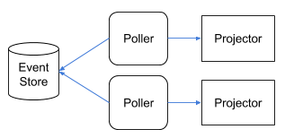

# Event Store
a simple implementation of an event store using only a database

This an exercise on how we could implement a event store and how this could be used with CQRS.

## Introduction

The implementation is done using a Postgresql database. 
For the IDs generation I used [xid](https://github.com/rs/xid), meaning that the IDs will be ordered in time.

> What is important is that for a given aggregate the events IDs are ordered.

A listener process can then poll the database for new events. The events can be published to a event bus or consumed directly.


In most of the implementations that I have seen, they all use some sort of event bus to deliver the domain events to external consumers. But there is a problem with this. It is not possible to write into a database and publish to a event bus in a transaction. Many things can go wrong, like for example, after writing to the database we fail to write into the event event bus. Even if it fails, there is no guarantee that it wasn't published.

Other solutions rely on some kind of sequence number, like serial in Postgres, to poll the next record to be read or to be published to a event bus.
This is cannot be done unless we take some precautions, because records will not become visible in the same order as the sequence number. 
Consider two concurrent transactions. One acquires the ID 100 and the other the ID 101. If the one with ID 101 is faster to finish the transaction, it will show up first in a query than the one with ID 100.

If the tracker service relies of this number to determine from where to pull, it could miss the last added record, and this could lead to events not being tracked.
Sequence numbers can only guarantee that they are unique, nothing else.

But there is a solution. We can introduce a latency in the que tracking queries, to allow for the concurrent transactions to complete. The track system will then only query up to the current time minus a safety margin.

```sql
SELECT * FROM events 
WHERE id >= $1
AND created_at <= NOW()::TIMESTAMP - INTERVAL'1 seconds'
ORDER BY id ASC
LIMIT 100
```

Using this approach, systems like RDBMS and Cockroach can be used.

This solution could evolve by plugging in a event bus. This MQ could be feeded by the tracker described above.

` events -> Event Store <- tracker process -> event bus <- projectors`

### NoSQL

It would seem that what we described above can't be applied to NoSQL databases.

The current solution takes advantage of the RDBMS transaction to make sure that a batch of events for an aggregate are correctly saved, but the same can be accomplished using a NoSQL database like MongoDB.

The only requirement is that that the database needs to provide unique constraints on multiple fields (aggregate_id, version). Then we would only need to write the events as an array inside the document record.
The schema would be something like:

`{ _id = 1, aggregate_id = 1, version = 1, events = [ { … }, { … }, { … }, { … } ] }`

Regarding the IDs we could use [xid](https://github.com/rs/xid), not forgetting to use the tracking query latency, mentioned above, to compensate server clock differences and latencies.

## Core Concepts

### ID

The presented solution uses PostgreSQL, but instead of SERIAL to uniquely identify an event, I will be using [xid](https://github.com/rs/xid)

### Snapshots

I will also use the memento pattern, to take snapshots of the current state, every X events.

Snapshots is a technique used to improve the performance of the event store, when retrieving an aggregate, but they don't play any part in keeping the consistency of the event store, therefore if we sporadically fail to save a snapshot, it is not a problem, so they can be saved in a separate go routine.

### Reactor Idempotency

When saving an aggregate, we have the option to supply an idempotent key. Later, we can check the presence of the idempotency key, to see if we are repeating an action. This can be useful when used in process manager reactors.

In most the examples I've seen, about implementing a process manager, it is not clear what the value is in breaking into several subscribers to handle every step of the process, and I think this is because they only consider the happy paths.
If the process is only considering the happy path, there is no advantage in having several subscribers, by the contrary.
If we introduce compensation actions, it becomes clear that there is an advantage in using a several subscribers to manage the "transaction" involving multiple aggregates.

In the following example I exemplify a money transfer with rollback actions, levering idempotent keys.

Here, Withdraw and Deposit need to be idempotent, but setting the transfer state does not. The former is a cumulative action while the former is not. 

> I don't see the need to use command handlers in the following examples

```go
func NewTransferReactor(es EventStore) {
    // ...
	l := NewPoller(es)
	cancel, err := l.Handle(ctx, func(c context.Context, e Event) {
        switch e.Kind {
        case "TransferStarted":
            OnTransferStarted(c, es, e)
        case "MoneyWithdrawn":
            OnMoneyWithdrawn(c, es, e)
        case "MoneyDeposited":
            OnMoneyDeposited(c, es, e)
        case "TransferFailedToDeposit":
            OnTransferFailedToDeposit(c, es, e)
        }
    })
    // ...
}

func OnTransferStarted(ctx context.Context, es EventStore, e Event) {
    event = NewTransferStarted(e)
    transfer := NewTransfer()
    es.GetByID(ctx, event.Transaction, &transfer)
    if !transfer.IsRunning() {
        return
    }
    
    // event.Transaction is the idempotent key for the account withdrawal
    exists, _ := es.HasIdempotencyKey(ctx, event.FromAccount, event.Transaction)
    if !exists {
        account := NewAccount()
        es.GetByID(ctx, event.FromAccount, &account)
        if ok := account.Withdraw(event.Amount, event.Transaction); !ok {
            transfer.FailedWithdraw("Not Enough Funds")
            es.Save(ctx, transfer, Options{})
            return
        }
        es.Save(ctx, account, Options{
            IdempotencyKey: event.Transaction,
        })
    }
}

func OnMoneyWithdrawn(ctx context.Context, es EventStore, e Event) {
    event := NewMoneyWithdrawnEvent(e)
    transfer := NewTransfer()
    es.GetByID(ctx, event.Transaction, &transfer)
    if !transfer.IsRunning() {
        return
    }
    
    transfer.Debited()
    es.Save(ctx, transfer, Options{})

    exists, _ = es.HasIdempotencyKey(ctx, transfer.ToAccount, transfer.Transaction)
    if !exists {
        account := NewAccount()
        es.GetByID(ctx, transfer.ToAccount, &account)
        if ok := account.Deposit(transfer.Amount, transfer.Transaction); !ok {
            transfer.FailedDeposit("Some Reason")
            es.Save(ctx, transfer, Options{})
            return
        }
        es.Save(ctx, account, Options{
            IdempotencyKey: transfer.Transaction,
        })
    }
}

func OnMoneyDeposited(ctx context.Context, es EventStore, e Event) {
    event := NewMoneyDepositedEvent(e)

    transfer = NewTransfer()
    es.GetByID(ctx, event.Transaction, &transfer)

    transfer.Credited()
    es.Save(ctx, transfer, Options{
        IdempotencyKey: idempotentKey,
    })
}

func OnTransferFailedToDeposit(ctx context.Context, es EventStore, e Event) {
    event := NewTransferFailedToDepositEvent(e)

    idempotentKey := event.Transaction + "/refund"
    exists, _ = es.HasIdempotencyKey(ctx, event.FromAccount, idempotentKey)
    if !exists {
        account := NewAccount()
        es.GetByID(ctx, event.FromAccount, &account)
        account.Refund(event.Amount, event.Transaction)
        es.Save(ctx, account, Options{
            IdempotencyKey: idempotentKey,
        })
    }
}
```

## Command Query Responsibility Segregation (CQRS)

An event store is where we store the events of an application that follows the event sourcing architecture pattern.
This pattern essentially is modelling the changes to the application as a series of events. The state of the application, at a given point in time, can always be reconstructed by replaying the events from the begging of time until that point in time.

CQRS is an application architecture pattern often used with event sourcing.

### Simple use

For a simple architecture, where we have a small number of projectors, we could use the existing event Listener. This event listener polls the database for new events at a regular interval (should be less than 1 second), from a given event id.
The projectors should take care of persisting the last handled event, so that in the case of a restart it will pick from the last known event.
It is also important to note that for each poller+projectors, there can only exist one instance working at a given time.




### Scalability

As the number of projectors increase, so the number of data store pollers increase and this will lead to an increase load of the database, due to the polling of the database at a short interval (less than one second).
At some point the database becomes overloaded with so many queries, that we will need a new strategy.

The offload of the database is accomplished by placing an event bus after the data store poller, and let the event bus deliver the events to the projectors, as depicted in the following picture:


The data store poller polls the database, and writes the events into the event bus.
If it fails to write into the event bus, it queries the message for the last message and start polling the database from there.
If the poller service restarts, it will do the same as before, querying the event bus for the last message.

On the projection side it is the same as before, but now with the extra care to not process already delivered events.
This is accomplished by ignoring events that are lesser or equal than the last handled event.

If the projection restarts, it will just start listening to the event bus from the last event. 

### Replay

Considering that the event bus should have a limited message retention window, replaying messages from a certain point in time can be achieved in the following manner:
1) get the position of the last consumed message from the event bus
2) consume events from the event store until we reach the event matching the previous event bus position
3) resume listening the event bus from the position of 1)  

### GDPR

According to the GDPR rules, we must completely remove the information that can identify a user. Making the information unreadable, by deleting encryption keys, is not enough.

This means that the data stored in the data store has to change, going against the rule that an event store should only be an append only "log".
Regarding the event-bus, this will not be a problem if we consider a limited retention window for messages (we have 30 days to comply with the GDPR).

```go
eventStore.Forget(ctx, ForgetRequest{
    AggregateID: id,
    EventKinds: []EventKind{
        {
            Kind:   "OwnerUpdated",
            Fields: []string{"owner"},
        },
    },
    SnapshotFields: []string{"owner"},
})
```
