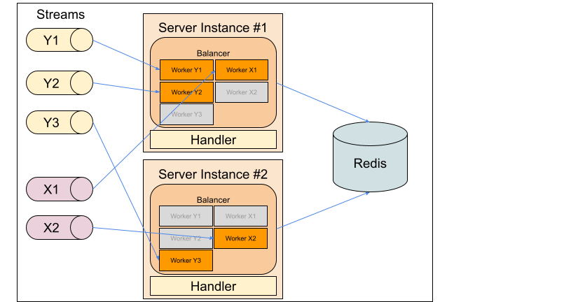

# Event Store
a simple implementation of an event store using a database

This an exercise on how I could implement a event store and how this could be used with CQRS.

## Introduction

The goal of this project is to implement an event store and how this event store could be used with the Event Sourcing + CQRS Architecture pattern where each side (write and read) can scale independently.

This library provides a common interface to store domain events in a database, like MongoDB, and to stream the events to an event bus like NATS.
To use CQRS it is not mandatory to have two separate databases, so it is not mandatory to plug in the change stream into the database. I f we would like to write the read model into the same database, we could easily extend the current implementation to allow an event handler for the read model (maybe in the future)

I went a bit further and also implemented an orchestration layer for the event consumer on the read side.

*This library started as an event store then it evolved to be a lot more, and that is why it wrongly named **eventstore*** 

I first talk about the several challenges and then about the solutions for those challenges.

## Design

This libraries implements the following pipeline:

A service **writes** to a **database** (the event store), a **forwarder** service listens to inserts into the database and forwards them into a **event bus**, then a **projection** listen to the event bus and creates the necessary views.


## How to

I assume that the reader is familiar with the concepts of event sourcing and CQRS.

> **Warning**: Code examples below may be outdated

### Aggregate

The aggregate must "extend" `eventstore.RootAggregate`, that implements `eventstore.Aggregater` interface, and implement `eventstore.Typer` and `eventstore.EventHandler` interface.
Any change to the aggregate is recorded as a series of events.

You can find an example [here](./test/aggregate.go#L95)

### Factory

Since we will deserializing events we will need a factory to instantiate the aggregate and also the events. This factory can be reused on the read side, to instantiate the events.

Example [here](./test/aggregate.go#L51)

### Codec

To encode and decode the events to and from binary data we need to provide a `eventstore.Codec`. This codec be as simple as a wrapper around `json.Marshaller/json.Unmarshaller` or a more complex implementation involving a schema registry.

### Upcaster

As the application evolves, domain events may change in a way that previously serialized events may no longer be compatible with the current event schema. So when we rehydrate an event, we must transform into an higher version of that event, and this is done by providing an implementation of the `eventstore.Upcaster` interface.

### Events

Events must implement the `eventstore.Eventer` interface.

Example [here](./test/aggregate.go#L17)

### Eventstore

The event data can be stored in any database. Currently we have implementations for:
* PostgreSQL
* MongoDB

After we choose one, we can instantiate our event store.

```go
esRepo := mongodb.NewStoreDB(client, cfg.EsName)
es := eventstore.NewEventStore(esRepo, cfg.SnapshotThreshold, entity.Factory{})
```

After that we just interact normally with the aggregate and then we save.

```go
id := uuid.New().String()
acc := test.CreateAccount("Paulo", id, 100)
acc.Deposit(10)
acc.Withdraw(20)
es.Save(ctx, acc)
```

to get the aggregate

```go
a, _ = es.GetByID(ctx, id)
acc2 := a.(*Account)
```

### Forwarder

After storing the events in a database we need to publish them into an event bus.
This is done with a `store.Feeder` and a `sink.Sinker`

```go
sinker := // targets an event bus
sinker.Init()

feeder := // listen to a inserts to a database
feeder.Feed(ctx, sinker)
```

In a distributed system where we can have multiple instance replicas of a service, we need to avoid duplication of events being forwarded to the message bus.
To avoid duplication and **keep the order of events** we could have only one active instance using a distributed lock to elect the leader.
But this would mean that we would have an idle instance and it is just a wast of resources.
To take advantage of all the replicas we can partition the events and balance the different partitions across the existing instances of the forwarder service.

**Example**: consider 2 forwarder instances and and we want to partition the events into 12 partitions.
Each forwarder instance would be responsible 6 partitions.

This is done with `store.Forwarder` that takes a *feed* and a *sink*. `store.Forwarder` implements `common.Tasker` so that it can be balanced among a set of workers. All workers are managed by `common.BalanceWorkers`

```go
sinker := sink.NewNatsSink(cfg.ConfigNats.Topic, partitions, "test-cluster", "pusher-id", stan.NatsURL(cfg.ConfigNats.NatsAddress))
defer sinker.Close()

dbURL := fmt.Sprintf("mongodb://%s:%s@%s:%d?connect=direct", cfg.EsUser, cfg.EsPassword, cfg.EsHost, cfg.EsPort)
pool, _ := lock.NewConsulLockPool(cfg.ConsulAddress)

lockMonitors := make([]common.LockWorker, len(partitionSlots))
for i, v := range partitionSlots {
    listener, _ := mongodb.NewFeed(dbURL, cfg.EsName, mongodb.WithPartitions(feedPartitions, v.From, v.To))

    lockMonitors[i] = common.LockWorker{
        Lock: pool.NewLock("forwarder-lock", cfg.LockExpiry),
        Worker: common.NewRunWorker("MongoDB -> NATS feeder", store.NewForwarder(
            listener,
            sinker,
        )),
    }
}

memberlist := common.NewRedisMemberlist(cfg.ConsulAddress, "forwarder-member", cfg.LockExpiry)
go common.BalanceWorkers(ctx, memberlist, lockMonitors, cfg.LockExpiry/2)
```

`common.RunWorker` also handles the restart from the last published in case of service crash or restart.

### Projection

Since events are being partitioned we use the same approach of spreading the partitions over a set of workers and then balance them over the service instances.



The above picture depicts the this balancing over several instances.

Consider a Projection A that listens for messages coming from topic X and Y.
If messages are partitioned into 2 partitions, we create a worker for each partition (we could also group partitions per worker). Each worker has an associated lock and a service instance can only run a worker for which it has a lock for. So `Projection A1` consumes messages in partition `X1` and `Y1` and `Worker 1` manages the `Projection A1` instance lifecycle.

To avoid a an instance to lock all the workers, we rely in a distributed member list.
This way a specific instance will only attempt to lock its share of workers.
For example, if we have 2 instances and 4 workers, one instance will only attempt to lock 2 workers as per the formula `locks = workers / instances`.
If the remainder is non zero, then every instance will attempt to lock one more worker, but only after all the instances have locked their share.
This is to avoid the following scenario.

Consider that we have 4 workers and 2 service instances and eagerly lock the extra worker.
Balancing them, as the instances come online, would happen int the following manner:

    1 instance -> 4 workers
    2 instances -> balanced to 2 workers each
    3 instances -> due to the non remainder, each would try to lock 2 workers, but since the first 2 instances already have a lock, they would not release it and the 3rd instance would have zero workers locked, ending in an unfair distribution.

I went the extra mile and also developed a projections rebuild capability where we replay all the events to rebuild any projection.

Request Rebuild projections
- Acquire Freeze Lock
- Emit Cancel projection notification
- Wait for all partitions listeners to acknowledge stopping (timeout 1s)
- handle the control to the projection for the rebuild
- Release Freeze Lock

Boot Partitioned Projection
- Wait for lock release (if any)
- Boot from the last position for this partition(s). The view stores the partition number and the - last event id.
- Start consuming the stream from the last event position
- Listen to Cancel projection notification


All that is handled by the following pseudo code (it may change since development is ongoing)

```go
esRepo := player.NewGrpcRepository(cfg.EsAddress)
natsSub, _ := subscriber.NewNatsSubscriber(ctx, cfg.NatsAddress, "test-cluster", "balance", cfg.Topic, NotificationTopic)

balancePartitions, err := common.ParseSlots(cfg.PartitionSlots)
prjCtrl := // instantiate the controller

workers := make([]common.LockWorker, len(balancePartitions))
for i, v := range balancePartitions {
    workers[i] = common.LockWorker{
        Lock: pool.NewLock("balance-worker", cfg.LockExpiry),
        Worker: common.NewRunWorker("Balance Projection", projection.NewProjectionPartition(
            balanceRebuild,
            prjCtrl,
            natsSub,
            projection.BootStage{
                AggregateTypes: []string{event.AggregateType_Account},
                Subscriber:     natsSub,
                Repository:     esRepo,
                PartitionLo:    v.From,
                PartitionHi:    v.To,
            },
        )),
    }
}

memberlist, _ := common.NewConsulMemberList(cfg.ConsulAddress, "balance-member", cfg.LockExpiry)
go common.BalanceWorkers(ctx, memberlist, workers, cfg.LockExpiry/2)
```

## Rationale

### Event Bus

The main challenge is, how to store events into a database and then propagate it to a event bus without losing any event.

In some of the implementations that I have seen, some sort of event bus is used to deliver the domain events to external consumers, without considering that it is not possible to write into a database and publish to a event bus in a transaction. There is no guarantee that this would always work.For example, we could use a transaction and publish to the event bus only if we were able to successfully insert in the database, but the commit may fail, resulting in an inconsistency between the database and the published event.

That being said, first we write to the database and then a second process picks up the database changes.

Below I present to options: Polling and Pushing (reactive)

*I implemented examples of both :)*

### IDs

Understanding how IDs are used and what is the best ID strategy that we can use, in my opinion, is the most important thing in an event sourcing and CQRS.

Having incremental IDs is very important so that we can replay the events in case of a failure and
also because, if events are incremental, it is easy to implement idempotency. For a specific aggregate, we just ignore events that have lower order than the last one received.

* **So we cannot insert events in the event store with IDs out of order?**

  We can, as long as this out of order events happens in different aggregates.
  For the same aggregate, the events ID must be monotonic. The order only matter for the aggregate.

* **If events are inserted out of order how will they impact the projections?**

  If what I said before is true, then it will not matter, even if consider projection built with different aggregates.
  Consider the aggregates A and B that are materialised in the projection C, so that `A + B = C`. This exactly the same as `B + A = C` 


Ideally we would like to have global monotonic events, but that is impossible to have unless we have a single node writer, creating a bottleneck.
Even then there is no guarantee that the events will appear in order if we have concurrent writes, unless we have some kind of lock at the node level, 
creating an even greater bottleneck.

So the event IDs have the following requirements:
1) The IDs only need to be monotonic for a given aggregate
2) Have globally some degree of order related to time

Since SQL databases usually use a number for incremental keys, and NoSQL databases use strings/uuids, I opted to use strings as the event ID.

There are some interesting decentralised IDs generator around the web, like the IDs generated by [oklog/ulid](https://github.com/oklog/ulid), that are ordered in time, with a millisecond precision, useful for databases where write operations don't happen in a single node.

Unfortunately, there is no guarantee that two nodes, generating IDs for an aggregate, that the IDs will be monotonic, due to clock skews or the randomness of the algorithm.

Compensating for clock skews, is easy if the tool allows to set the time, but for the randomness, not so much.

Taking a step back, what do we need our ID to be? For a given aggregate, we need it to be monotonic and Lexicographically sortable.
That can be achieved if we consider an ID that has `time + aggregate ID + version`. I could just use it like that, but to make it internet friendly and the smallest possible, I ended up encoding it in base32 (base64 has to many ugly characters)
With that goal in mind I created a small [tool](./eventid/eventid.go) that handles this composite ID.

### Polling

We need to forward the events in the event store to processes building the projections.
One of the ways to achieve this is by polling.

Events should be stored with an incremental sortable key. With this we can then poll for events after the last polled event.

> What is important is that for a given aggregate the events IDs are ordered, so strict ordering between aggregates is not important.

A poller process can then poll the database for new events. The events can be published to a event bus or consumed directly.

> Consuming events is discuss in more detail below, in CQRS section. 

But there is a catch. Even if we use a single node writer, records might not become available in the same order as the ID order.
Consider two concurrent transactions relying on database sequence. One acquires the ID 100 and the other the ID 101. If the one with ID 101 is faster to finish the transaction, it will show up first in a query than the one with ID 100.
Unless we take some precautions, records will not always become visible in the expected order.

If we have a polling process that relies on this number to determine from where to start polling, it could miss the last added record, and this could lead to events not being tracked.

But there is a solution. We can only retrieving events older than X milliseconds, to allow for the concurrent transactions to complete or to mitigate the clock skews.

An example of how this could be done in PostgreSQL:

```sql
SELECT * FROM events 
WHERE id >= $1
AND created_at <= NOW()::TIMESTAMP - INTERVAL'1 seconds'
ORDER BY id ASC
LIMIT 100
```

This polling strategy can be used both with SQL and NoSQL databases, like Postgresql or MongoDB, to name a few.

I would like to say that I would use polling strategy on databases where it is not easy to implement change data capture, like MySQL because it is simple to understand and straight forward to implement.

Advantages:
* Easy to implement

Disadvantages
* Network costs. If the data is updated infrequently we will be polling with no results. On the other hand, if the data change frequency is hight then there will be no difference.
* events that depend on others will have an accumulated delay due to the time delay applied to the query.

### Pushing

The above polling solution is a solution that works for all kinds of databases.

This is not saying that there aren't other solutions that would work better. Some database provide notification mechanisms from where we collect the changes, like `change streams` from MongoDB.

PostgreSQL also has the `LISTEN / NOTIFY` feature that allow us to be notified on a record change [example](https://pkg.go.dev/github.com/lib/pq/example/listen?tab=doc.)


### NoSQL

When we interact with an aggregate, several events may be created. 

If a SQL database is used, like PostgreSQL, we create a record per event and used a transaction to guarantee consistency.

For document NoSQL databases, like MongoDB, the solution is to use one document with the array of events inside, as a sub-collection.
The only requirement is that the database needs to provide unique constraints on multiple fields (aggregate_id, version).

The record would be something like:

`{ _id = 1, aggregate_id = 1, version = 1, events = [ { … }, { … }, { … }, { … } ] }`

This project provides examples of both.

### Snapshots

I will also use the memento pattern, to take snapshots of the current state, every X events.

Snapshots is a technique used to improve the performance of the event store, when retrieving an aggregate, but they don't play any part in keeping the consistency of the event store, therefore if we sporadically fail to save a snapshot, it is not a problem, so they can be saved in a separate transaction and in a go routine.

### Idempotency

When saving an aggregate, we have the option to supply an idempotent key. Later, we can check the presence of the idempotency key, to see if we are repeating an action. This can be useful when used in process manager reactors.

In the following example I exemplify a money transfer with rollback actions, leveraging idempotent keys.

Here, Withdraw and Deposit need to be idempotent, but setting the transfer state does not. The latter is idempotent action while the former is not. 

> I don't see the need to use command handlers in the following examples

Some pseudo code:

```go
func NewTransferReactor(es EventStore) {
    // ...
	l := NewPoller(es)
	cancel, err := l.Handle(ctx, func(c context.Context, e Event) {
        switch e.Kind {
        case "TransferStarted":
            OnTransferStarted(c, es, e)
        case "MoneyWithdrawn":
            OnMoneyWithdrawn(c, es, e)
        case "MoneyDeposited":
            OnMoneyDeposited(c, es, e)
        case "TransferFailedToDeposit":
            OnTransferFailedToDeposit(c, es, e)
        }
    })
    // ...
}

func OnTransferStarted(ctx context.Context, es EventStore, e Event) {
    event = NewTransferStarted(e)
    transfer := NewTransfer()
    es.GetByID(ctx, event.Transaction, &transfer)
    if !transfer.IsRunning() {
        return
    }
    
    // event.Transaction is the idempotent key for the account withdrawal
    exists, _ := es.HasIdempotencyKey(ctx, event.FromAccount, event.Transaction)
    if !exists {
        account := NewAccount()
        es.GetByID(ctx, event.FromAccount, &account)
        if ok := account.Withdraw(event.Amount, event.Transaction); !ok {
            transfer.FailedWithdraw("Not Enough Funds")
            es.Save(ctx, transfer, Options{})
            return
        }
        es.Save(ctx, account, Options{
            IdempotencyKey: event.Transaction,
        })
    }
}

func OnMoneyWithdrawn(ctx context.Context, es EventStore, e Event) {
    event := NewMoneyWithdrawnEvent(e)
    if event.Transaction == "" {
        return
    }

    transfer := NewTransfer()
    es.GetByID(ctx, event.Transaction, &transfer)
    if !transfer.IsRunning() {
        return
    }
    
    transfer.Debited()
    es.Save(ctx, transfer, Options{})

    exists, _ = es.HasIdempotencyKey(ctx, transfer.ToAccount, transfer.Transaction)
    if !exists {
        account := NewAccount()
        es.GetByID(ctx, transfer.ToAccount, &account)
        if ok := account.Deposit(transfer.Amount, transfer.Transaction); !ok {
            transfer.FailedDeposit("Some Reason")
            es.Save(ctx, transfer, Options{})
            return
        }
        es.Save(ctx, account, Options{
            IdempotencyKey: transfer.Transaction,
        })
    }
}

func OnMoneyDeposited(ctx context.Context, es EventStore, e Event) {
    event := NewMoneyDepositedEvent(e)
    if event.Transaction == "" {
        return
    }

    transfer = NewTransfer()
    es.GetByID(ctx, event.Transaction, &transfer)

    transfer.Credited()
    es.Save(ctx, transfer, Options{
        IdempotencyKey: event.Transaction,
    })
}

func OnTransferFailedToDeposit(ctx context.Context, es EventStore, e Event) {
    event := NewTransferFailedToDepositEvent(e)

    idempotentKey := event.Transaction + "/refund"
    exists, _ = es.HasIdempotencyKey(ctx, event.FromAccount, idempotentKey)
    if !exists {
        account := NewAccount()
        es.GetByID(ctx, event.FromAccount, &account)
        account.Refund(event.Amount, event.Transaction)
        es.Save(ctx, account, Options{
            IdempotencyKey: idempotentKey,
        })
    }
}
```

---

## Command Query Responsibility Segregation (CQRS) + Event Sourcing

An event store is where we store the events of an application that follows the event sourcing architecture pattern.
This pattern essentially is modelling the changes to the application as a series of events. The state of the application, at a given point in time, can always be reconstructed by replaying the events from the begging of time until that point in time.

CQRS is an application architecture pattern often used with event sourcing.

### Architecture

Next I present a possible architecture.


The write service writes to the database, the changes are captured by the Forwarder service and published to the event bus. The read service listen to the event bus and updates the views according to the received events.

> The Forwarder service process could instead be inside the write service since it has direct access to the database.
> 
> **Pros**: it decreasing the complexity of the architecture
> 
> **Cons**: if we want to cut off the stream of events (for example, to increase partitions) it would be more work. This could be easily overcome by using some flag to enable/disable the forwarding of events.

If the Forwarder service fails to write into the event bus, it will try again. If it restarts, it queries the event bus for the last message and start polling the database from there.
> If it is not possible to get the last published message to the event bus, we can store it in a database.
> Writing repeated messages to the event bus is not a concern, since the used event bus must guarantee `at least once` delivery. It is the job of the projector to be idempotent, discarding repeated messages.

On the projection side we would store the last position in the event bus, so that in the event of a restart, we would know from where to replay the messages.

### Instances

Depending on the rate of events being written in the event store, the Forwarder service may not be able to keep up and becomes a bottleneck.
When this happens we need to create more polling services that don't overlap when polling events.
Overlapping can be avoided by filtering over metadata.
What this metadata can be and how it is stored will depend in your business case.
A good example is to have a Forwarder service per set of aggregates types of per aggregate type.
As an implementation example, for a very broad spectrum of problem, events can be stored with with generic labels, that in turn can be used to filter the events. Each Forwarder service would then be sending events into its own event bus topic.

> To be honest, if we use a Forwarder service per write service I don't see how this would ever be a bottleneck, but again, we never know.

### Key Partition

Since we only have one instance responsible for creating a projection, the read side may become a bottleneck as it handles more aggregates and do more database operations to create a consistent projection. An approach is needed to evenly distribute this load over the existing services instances, and this can be done with key partitioning.

> I could not find any stream messaging solution that would give key partition in dynamic way, where the rebalancing of the partitions would automatically as the nodes come and go.

> Another approach is to distribute projections over the existing instances.

So, on the read side, consider that we are interested in creating 12 partitions (it a good idea to create a reasonable amount of partitions from the start so that when we add more services instances we can spread them easily). In the Forwarder service side we would publish events into 12 topics, `topic.1`, `topic.2` ... `topic.12` each representing a partition. To select what event goes on what topic, we would mod over the hash of the event ID.

```go
topicNr := hash(event.ID)%12
```

On the consumer side we would create partition slots and balance them through the available instances. Each service instance would keep track of all instances, and would release or grab the slots according to the number of instances.

Example:

Consider we have 3 replicas and an environment variable declaring 3 slots: `PARTITION_SLOTS=1-4,5-8,9-12`

Consider that we also have a way to get the member list for a service (using hashicorp consul or a custom redis implementation where we keep track of the service replicas) and a distributed lock (consul, redis).

At a given time, a service instance can only have `x` locked slots, where `x=(number of slots)/(number of members)`.

On boot time, the first service would see that are no other members and would lock all the slots. `x=3/1=3`
When the second instance comes up, the number of slots to lock become `x=3/2=1.5~2` so the instance #1 will release one instance (3 locked slots - 1) that will be locked instance #2.
When the third instance comes we will have `x=3/3=1`, and instance #1 release one slot, and this slot will be locked by instance #3.

A downside is that this approach is not "elastic", in the sense that adding or removing a partition instance is a manual process.
Starting with a reasonable large enough of partitions will minimize the this impact.

eg: 12 partitions
2 instances
```
instance #1 - 1-6
instance #2 - 7-12
```

3 instances
```
instance #1 - 1-4
instance #2 - 5-8
instance #3 - 9-12
```

The idempotency is still guaranteed for each aggregate.

### Replay

Considering that the event bus should have a limited message retention window, replaying messages from a certain point in time can be achieved in the following manner:
1) Stop the respective consumer
1) get the position of the last message from the event bus
1) consume events from the event store until we reach the event matching the previous event bus position
1) resume listening the event bus from the position of 2)

### GDPR

According to the GDPR rules, we must completely remove the information that can identify a user. It is not enough to make the information unreadable, for example, by deleting encryption keys.

This means that the data stored in the data store has to change, going against the rule that an event store should only be an append only "log".

Regarding the event-bus, this will not be a problem if we consider a limited retention window for messages (we have 30 days to comply with the GDPR).

## gRPC codegen
```sh
./codegen.sh ./api/proto/*.proto
```
